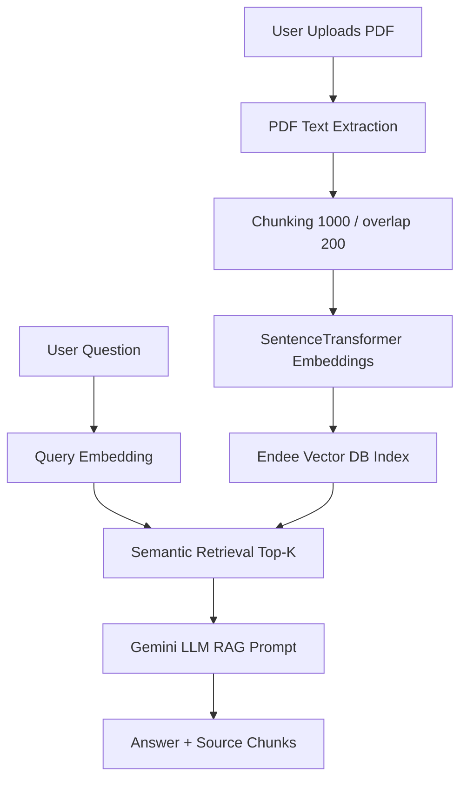

# AI Research Paper Assistant (Semantic Search + RAG)

This project demonstrates a complete retrieval-augmented generation system for research papers using:

- Vector embeddings
- Semantic retrieval
- Endee vector database integration
- LLM-based answer generation
- Production-style service structure (FastAPI + Streamlit)

## 1. Problem Statement

Researchers and students often need answers from long PDFs quickly. Keyword search misses semantic meaning and wastes time.

This system lets users upload research papers, index them as embeddings in Endee, and ask natural-language questions. The system retrieves semantically relevant chunks and uses an LLM to generate grounded answers with source attribution.

## 2. System Architecture Diagram



## 3. Tech Stack

- Backend: `FastAPI`, `Uvicorn`
- Frontend: `Streamlit`
- PDF Parsing: `PyPDF`
- Chunking: `LangChain RecursiveCharacterTextSplitter`
- Embeddings: `sentence-transformers/all-MiniLM-L6-v2`
- Vector Database: `Endee` (HTTP API)
- LLM: `Google Gemini` via `langchain-google-genai`
- Transport/Parsing: `requests`, `msgpack`

## 4. Core Features

1. PDF Knowledge Base
- Upload paper PDF
- Extract text page-wise
- Chunk by configurable size/overlap
- Embed and store vectors in Endee

2. Vector Embedding Storage
- Embeddings generated using MiniLM
- Stored with metadata:
  - document id
  - source file
  - page number
  - chunk index
  - chunk text

3. Semantic Search
- User query -> embedding
- Endee vector search (`top_k`)
- Return closest chunks by similarity

4. RAG Answering
- Build prompt from retrieved chunks
- Generate final answer using Gemini
- Return answer with sources

5. Streamlit Chat UI
- Upload PDF
- Ask question
- View answer and cited source pages

## 5. Project Structure

```text
endee-rag-assistant/
|-- app/
|   |-- database/endee_client.py
|   |-- services/
|   |   |-- ingestion_service.py
|   |   |-- embedding_service.py
|   |   |-- retrieval_service.py
|   |   |-- vector_store_service.py
|   |   `-- rag_service.py
|   |-- utils/
|   |   |-- pdf_loader.py
|   |   `-- text_chunker.py
|   |-- config.py
|   |-- schemas.py
|   `-- main.py
|-- frontend/streamlit_app.py
|-- .env.example
|-- requirements.txt
`-- main.py
```

## 6. Setup Instructions

### Step 1: Start Endee Server

Run Endee on port `8080` (example from the Endee docs):

```bash
docker run \
  --ulimit nofile=100000:100000 \
  -p 8080:8080 \
  -v ./endee-data:/data \
  --name endee-server \
  --restart unless-stopped \
  endeeio/endee-server:latest
```

### Step 2: Install Python Dependencies

```bash
pip install -r requirements.txt
```

### Step 3: Configure Environment

Create `.env` from `.env.example` and set at least:

- `GOOGLE_API_KEY` (for LLM answers)
- `ENDEE_BASE_URL` (default: `http://localhost:8080`)
- `EMBEDDING_MODEL` (default: `sentence-transformers/all-MiniLM-L6-v2`)

### Step 4: Run Backend

```bash
python main.py
```

### Step 5: Run Frontend

```bash
streamlit run frontend/streamlit_app.py
```